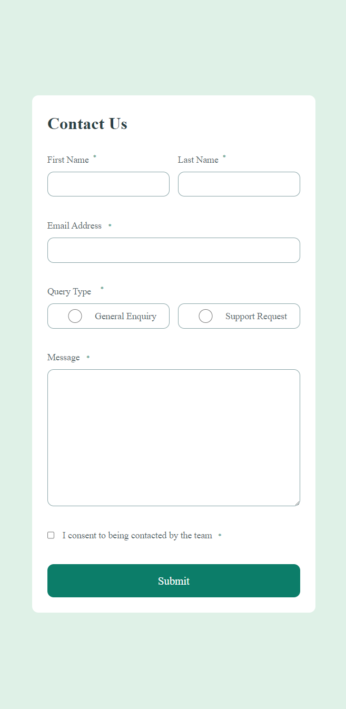

# Frontend Mentor - Contact Form

This is a solution to the [Contact Form Challenge](https://www.frontendmentor.io/challenges/contact-form--G-hYlqKJj/hub) from frontendmentor.com.
[Hosted on GH pages](https://nielsfechtel.github.io/frontendmentor_contactform).

## Overview

### Screenshot

### What I learned

Used a container-query.
However, I couldn't quite figure out how to do the red 'This input is required'-messages.

## Author

- Website - [Niels Fechtel](https://niels-fechtel.com)
